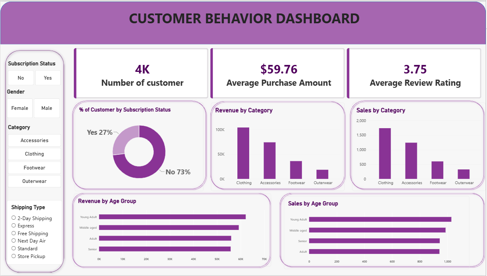

# Customer Behavior Analysis

An end-to-end data analytics project on retail customer shopping behavior. Raw data is cleaned and feature-engineered in **pandas**, loaded into **PostgreSQL**, analyzed through 10 business questions in **SQL**, and presented in an interactive **Power BI** dashboard.



---

## Tech Stack

- **Python** (pandas) — data cleaning & feature engineering
- **PostgreSQL** + **SQLAlchemy** — data storage & SQL analysis
- **Power BI** — interactive dashboard

## Pipeline

```
CSV  →  pandas (clean + feature engineer)  →  PostgreSQL  →  SQL analysis  →  Power BI dashboard
```

## Dataset

`customer_shopping_behavior.csv` — 3,900 customer records, 18 columns.

| Field group | Columns |
|---|---|
| Customer profile | Customer ID, Age, Gender, Location |
| Transaction | Item Purchased, Category, Purchase Amount (USD), Size, Color, Season |
| Experience | Review Rating, Shipping Type, Payment Method |
| Loyalty / promotions | Subscription Status, Discount Applied, Promo Code Used, Previous Purchases, Frequency of Purchases |

**Baseline stats**

| Metric | Value |
|---|---|
| Records | 3,900 |
| Age | 18 – 70 (mean 44.1) |
| Purchase amount | $20 – $100 (mean $59.76) |
| Review rating | 2.5 – 5.0 (mean 3.75) |
| Previous purchases | 1 – 50 (mean 25.4) |

Purchase amount is spread almost uniformly between $20 and $100, so there are no high-value outlier customers in this data — any "who spends more" comparison will show small differences by nature of the dataset.

---

## 1. Data Cleaning (pandas)

| Step | What was done | Why |
|---|---|---|
| Missing values | 37 nulls in `review_rating` filled with the **median rating of that product category** | Preserves category-level rating behavior instead of flattening to one global mean |
| Column standardization | Lowercased all names, replaced spaces with underscores, renamed `purchase_amount_(usd)` → `purchase_amount` | Makes the table SQL-safe once loaded into PostgreSQL |
| Redundant column removed | `promo_code_used` dropped after confirming `(discount_applied == promo_code_used).all()` returned True | The two columns are 100% identical — keeping both adds no information |

> **Note:** discount and promo code are perfectly collinear in this dataset, so their individual effects can't be separated. Any conclusion about promotions applies to both together.

## 2. Feature Engineering

- **`age_group`** — Young Adult / Adult / Middle-aged / Senior, via `pd.qcut(age, q=4)`
- **`purchase_frequency_days`** — mapped frequency labels to day counts (Weekly → 7, Fortnightly/Bi-Weekly → 14, Monthly → 30, Quarterly/Every 3 Months → 90, Annually → 365)

## 3. SQL Analysis

Cleaned data loaded into PostgreSQL (`customer_behavior` database, `customer` table) via SQLAlchemy, then queried to answer 10 business questions:

| # | Business question | SQL technique used |
|---|---|---|
| Q1 | Total revenue by gender | `GROUP BY` + `SUM` |
| Q2 | Customers who discounted but still spent above average | Scalar subquery in `WHERE` |
| Q3 | Top 5 products by average review rating | `AVG`, `ROUND`, `ORDER BY … LIMIT` |
| Q4 | Standard vs Express shipping — average spend | Filtered aggregation with `IN` |
| Q5 | Do subscribers spend more? | Multi-metric aggregation |
| Q6 | Top 5 products by discount penetration | Conditional aggregation (`SUM(CASE WHEN …)`) |
| Q7 | Segment customers: New / Returning / Loyal | CTE + `CASE` bucketing |
| Q8 | Top 3 products within each category | Window function — `ROW_NUMBER() OVER (PARTITION BY …)` |
| Q9 | Do repeat buyers (>5 purchases) subscribe more? | Filtered `GROUP BY` |
| Q10 | Revenue contribution by age group | Aggregation on engineered `age_group` |

See [`customer_behaivor_sql_queires.sql`](./customer_behaivor_sql_queires.sql) for all queries.

## 4. Power BI Dashboard

Interactive dashboard with:
- **KPI cards** — number of customers (4K), average purchase amount ($59.76), average review rating (3.75)
- **Visuals** — % of customers by subscription status (donut), revenue by category, sales by category, revenue by age group, sales by age group
- **Slicers** — Subscription Status, Gender, Category, Shipping Type

---

## Key Insights

- **Subscription is low.** Only 27% of customers are subscribed; 73% are not — the largest untapped lever in this dataset.
- **Clothing dominates.** It leads both revenue (~$100K) and order volume (~1,700 orders), followed by Accessories, then Footwear, with Outerwear last on both measures.
- **Revenue follows volume, not basket size.** The revenue ranking and order-count ranking by category are identical — spend per order is tightly bunched, so category revenue is driven by how many people buy, not how much they spend per order.
- **Young Adults are the top segment** on both revenue and order count, with Middle-aged close behind.
- **Ratings are mediocre across the board.** An average of 3.75/5, with the 25th percentile at 3.1, suggests a product/experience quality issue that isn't concentrated in one category.

## Recommendations

- Target the highest-frequency non-subscribers (weekly/fortnightly buyers) with a subscription offer — they already have the cadence the program rewards.
- Pull back blanket discounting and test it only on Outerwear and Footwear, the two weakest-volume categories.
- Investigate the lowest-rated products before investing further in promotions for them.
- Use Young Adult buying patterns as the acquisition-campaign template, since that segment converts at the highest rate.

## Limitations

- **No time dimension** — no order date, so no trend, cohort, or retention-over-time analysis is possible; `season` is the only temporal proxy.
- **Discount and promo code are collinear**, so their individual effects can't be separated.
- **`previous_purchases` is a running total, not a transaction log**, so customer lifetime value can only be approximated.
- **Next step:** run a statistical significance test (e.g. two-sample comparison of subscriber vs. non-subscriber spend) rather than relying on raw averages.

---

## Repository Contents

| File | Description |
|---|---|
| `customer_behavior_analysis.ipynb` | Data cleaning, feature engineering, and PostgreSQL load |
| `customer_behaivor_sql_queires.sql` | 10 SQL business-question queries |
| `customer_behavior_dashboard.pbix` | Power BI dashboard |
| `dashboard_screenshot.png` | Dashboard screenshot |
